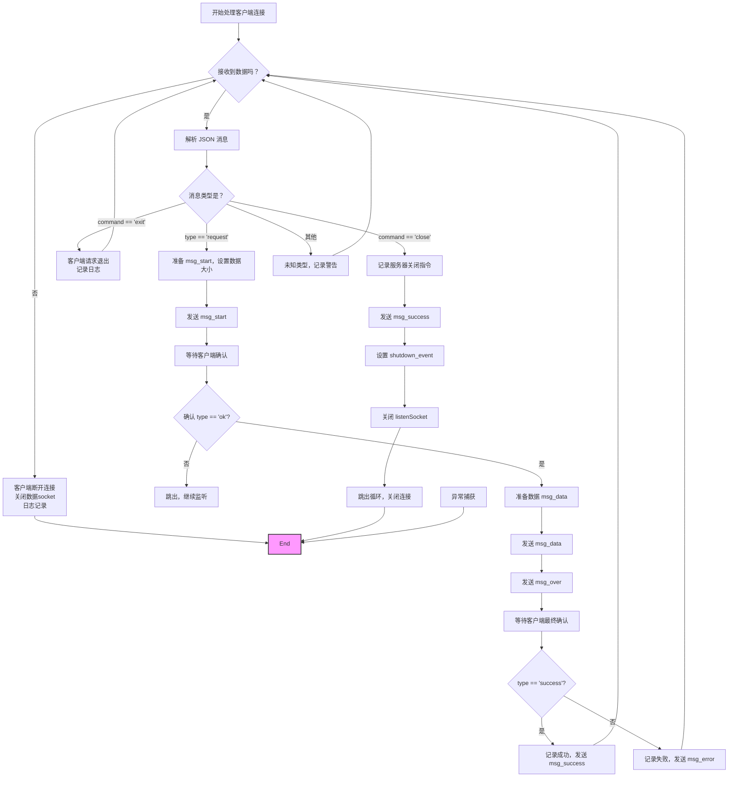

```mermaid
flowchart TD
    A[开始处理客户端连接] --> B{接收到数据吗？}
    B -- 否 --> Z1[客户端断开连接\n关闭数据socket\n日志记录] --> End
    B -- 是 --> C[解析 JSON 消息]

    C --> D{消息类型是？}

    D -- "type == 'request'" --> E[准备 msg_start，设置数据大小]
    E --> F[发送 msg_start]
    F --> G[等待客户端确认]
    G --> H{确认 type == 'ok'?}
    H -- 否 --> Z2[跳出，继续监听]
    H -- 是 --> I[准备数据 msg_data]
    I --> J[发送 msg_data]
    J --> K[发送 msg_over]
    K --> L[等待客户端最终确认]
    L --> M{type == 'success'?}
    M -- 是 --> N[记录成功，发送 msg_success]
    M -- 否 --> O[记录失败，发送 msg_error]
    N --> B
    O --> B

    D -- "command == 'exit'" --> P[客户端请求退出\n记录日志] --> B

    D -- "command == 'close'" --> Q[记录服务器关闭指令]
    Q --> R[发送 msg_success]
    R --> S[设置 shutdown_event]
    S --> T[关闭 listenSocket]
    T --> U[跳出循环，关闭连接]
    U --> End

    D -- 其他 --> V[未知类型，记录警告] --> B

    Z[异常捕获] --> End
    style End fill:#f9f,stroke:#333,stroke-width:2px

```